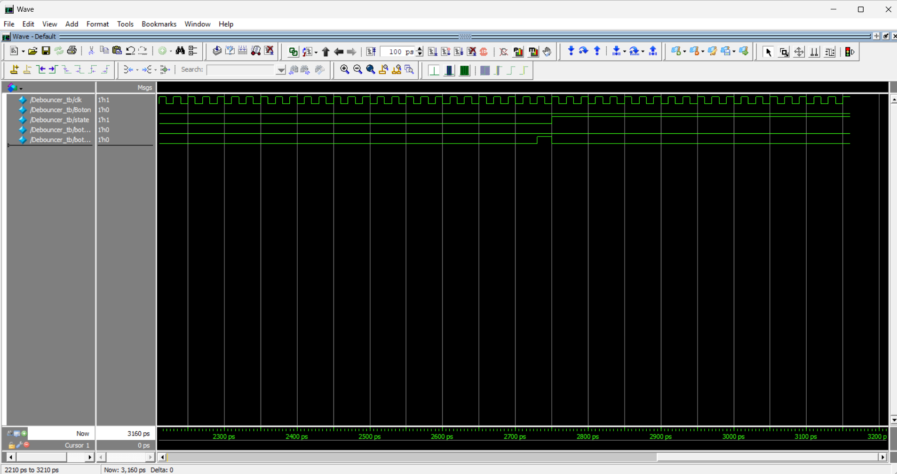
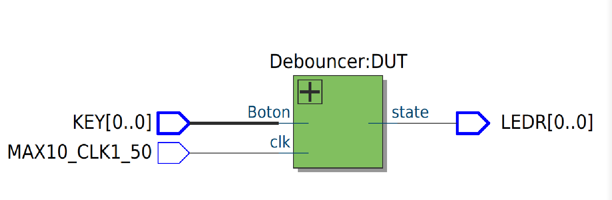
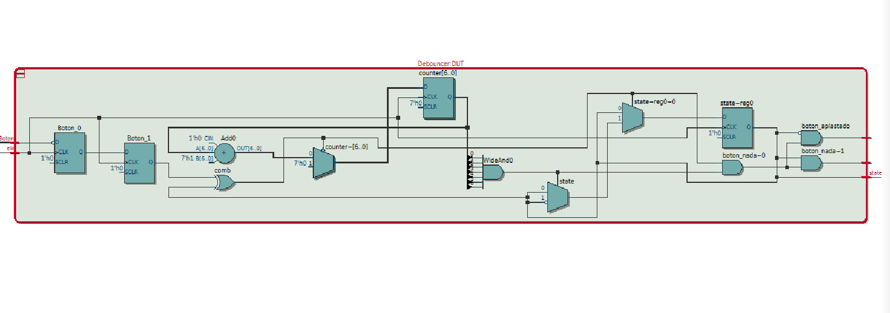

# Ana Cristina Chávez Acosta - A01742237  
## Challenge Sorpresa — Debouncer para Botón (Sincronización + Filtro de Rebote)

### Objetivo
Comprender e implementar un **debouncer** en **Verilog** para eliminar el rebote mecánico (bounce) de un botón físico en FPGA.  
El reto consistió en:

- Analizar el comportamiento de un debouncer (sincronización + conteo de estabilidad)
- Implementar el módulo en Verilog
- Diseñar un **testbench** con escenarios de rebote
- Probar en simulación y después en hardware (DE10-Lite)
- Entender por qué un debouncer es crítico para sistemas digitales (FSM, contadores, UART start, etc.)

---

## ¿Por qué necesitamos un debouncer?
Cuando se presiona un botón mecánico, la señal **no cambia limpio** de 1→0 (o 0→1).  
En realidad se generan múltiples transiciones rápidas en pocos milisegundos (rebote), lo que puede causar:

- múltiples incrementos en un contador
- múltiples cambios de estado en una FSM
- eventos falsos (“doble click”) aunque se presione una sola vez

Un **debouncer** fuerza a que el cambio de estado ocurra **solo cuando la entrada se mantiene estable** por un tiempo.

---

## Descripción del funcionamiento

### 1) Sincronización (2 flip-flops)
Para evitar metastabilidad al muestrear una señal asíncrona (botón), el diseño usa dos registros en serie:

- `Boton_0` captura el botón (invertido para que sea activo en alto internamente)
- `Boton_1` vuelve a sincronizar

Esto hace que el sistema trabaje con una señal más segura dentro del dominio de reloj.

---

### 2) Filtro por conteo (estabilidad)
El debouncer compara:
- `state`: estado estable actual del botón (debounced)
- `Boton_1`: lectura sincronizada actual

Si `Boton_1` **es diferente** a `state`, empieza un contador (`counter`).  
Solo si `counter` llega a su máximo (todas las bits en 1), se acepta el cambio y se actualiza `state`.

**Señales clave:**
- `IDLE = (state == Boton_1)` → no hay cambio pendiente
- `MAX = &counter` → contador llegó al máximo

---

### 3) Pulsos de evento (aplastado / soltado)
Se generan dos “pulsos” útiles (1 ciclo) cuando el cambio se confirma:

- `boton_aplastado`: evento cuando se detecta una presión estable
- `boton_nada`: evento cuando se detecta una liberación estable

---

## Archivos del challenge

### `Debouncer.v`
Módulo principal del debouncer:
- Entrada: `Boton`, `clk`
- Salidas: `state`, `boton_nada`, `boton_aplastado`

---

### `Debouncer_tb.v`
Testbench del módulo:
- Genera reloj
- Simula rebote alternando rápidamente el botón (0/1 varias veces)
- Luego mantiene el botón presionado suficiente tiempo para que el contador llegue a `MAX`
- Permite verificar que **state cambia solo una vez** a pesar del rebote

---

### `Debouncer_tarjeta.v`
Wrapper para probar en la DE10-Lite:
- Conecta `KEY[0]` al debouncer
- Muestra el `state` estable en `LEDR[0]`

---

## Pruebas realizadas

### Simulación (Testbench)
Se probó:
- Botón inicialmente “sin presionar” (lógica invertida en hardware)
- Rebote: cambios rápidos 0↔1 durante pocos ciclos
- Presión sostenida: se mantiene presionado el tiempo suficiente para que `counter` llegue a `MAX`
- Verificación de:
  - `state` cambia una sola vez
  - `boton_aplastado` se activa únicamente cuando el cambio es válido

### Hardware (DE10-Lite)
Se verificó que:
- El LED no parpadea por rebote
- El estado cambia únicamente al presionar de forma estable

---

## Evidencias

### Simulación (Waveform)

### Diagrama RTL

