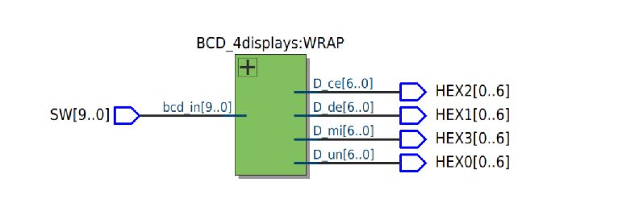
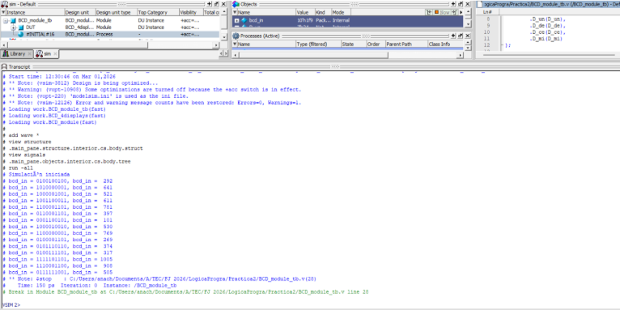
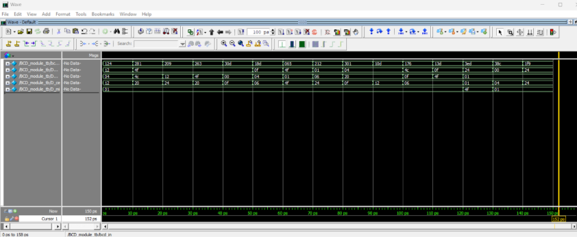
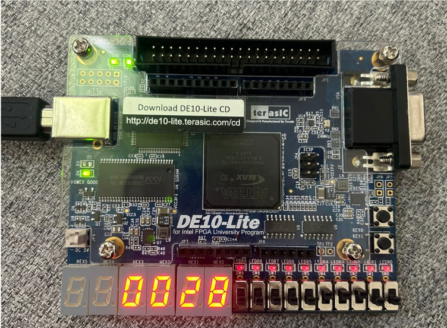
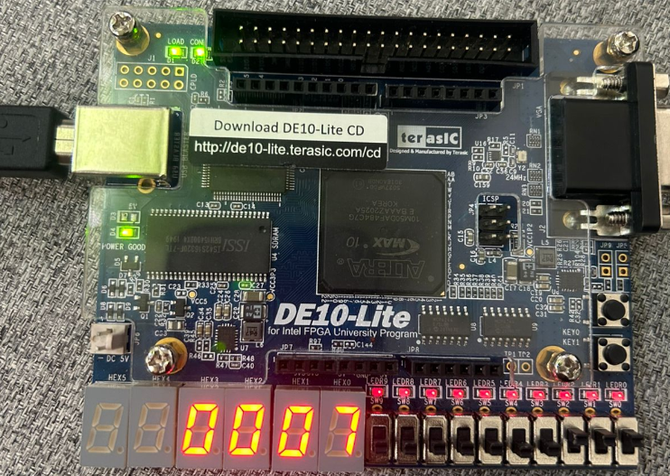

# Ana Cristina Chávez Acosta - A01742237  
## Práctica #2 — Decoder BCD a 4 Displays (DE10-Lite)

### Objetivo
Implementar un sistema en **Verilog** que lea un número de **10 bits** desde los switches de la FPGA (**SW[9:0]**), lo convierta a **dígitos decimales** (unidades, decenas, centenas y millares) y muestre cada dígito en **4 displays de 7 segmentos** (**HEX0–HEX3**) de la tarjeta **DE10-Lite**.

---

## Materiales necesarios
- Tarjeta FPGA **DE10-Lite**
- Cable **USB Blaster**
- **Intel Quartus Prime Lite**
- Archivos Verilog del módulo y su testbench

---

## Descripción del funcionamiento
- La entrada `SW[9:0]` representa un valor entre **0 y 1023**.
- El módulo separa el número en:
  - **Unidades** = `bcd_in % 10`
  - **Decenas** = `(bcd_in / 10) % 10`
  - **Centenas** = `(bcd_in / 100) % 10`
  - **Millares** = `(bcd_in / 1000) % 10`
- Cada dígito (0–9) se envía a un decodificador de 7 segmentos para encender los segmentos correctos.
- Los 4 displays muestran el número decimal (millares-centenas-decenas-unidades).

---

## Desarrollo de la práctica

### 1) Entradas y salidas
**Entradas:**
- `SW[9:0]` (Switches de la DE10-Lite)

**Salidas:**
- `HEX0` → Unidades  
- `HEX1` → Decenas  
- `HEX2` → Centenas  
- `HEX3` → Millares  

> Nota: En este diseño cada `HEXx` usa 7 bits (segmentos del display).

---

## Descripción de módulos

### `BCD_module`
Decodificador para **un solo display** de 7 segmentos.

**Entrada:**
- `bcd_in[3:0]` (valor 0–9)

**Salida:**
- `bcd_out[0:6]` (segmentos del display)

Convierte cada dígito decimal (0 a 9) al patrón correspondiente de segmentos.  
Para valores fuera de 0–9 se coloca un patrón por defecto.

---

### `BCD_4displays`
Convierte el número de entrada en 4 dígitos y usa 4 instancias de `BCD_module`.

**Entrada:**
- `bcd_in[N_in-1:0]` (por defecto `N_in = 10`)

**Salidas:**
- `D_un, D_de, D_ce, D_mi` (cada uno de 7 bits)

---

### `BCD_w` (Wrapper para la FPGA)
Wrapper para mapear directamente:
- `SW[9:0]` → `bcd_in`
- `HEX0..HEX3` → salidas hacia los displays

---

## Testbench
El testbench **`BCD_module_tb.v`** verifica el funcionamiento del sistema completo (`BCD_4displays`):

- Genera valores aleatorios para `bcd_in` (módulo 1024)
- Aplica varios casos con `repeat(15)`
- Monitorea `bcd_in` en binario y decimal usando `$monitor`

---

## Evidencias

### Diagrama RTL
**RTL:** 

### Testbench
**Testbench:** 

### Simulación (Waveform)
**Waveform:** 

### FPGA en funcionamiento
**DE10-Lite funcionando:** 
**DE10-Lite funcionando:** 

---

## Archivos del proyecto
- `Practica2_BCD_Decoder/BCD_module.v` — Decoder BCD a 7 segmentos (1 display)
- `Practica2_BCD_Decoder/BCD_4displays.v` — Separación en unidades/decenas/centenas/millares
- `Practica2_BCD_Decoder/BCD_w.v` — Wrapper para DE10-Lite (SW → HEX0..HEX3)
- `Practica2_BCD_Decoder/BCD_module_tb.v` — Testbench (pruebas aleatorias)
