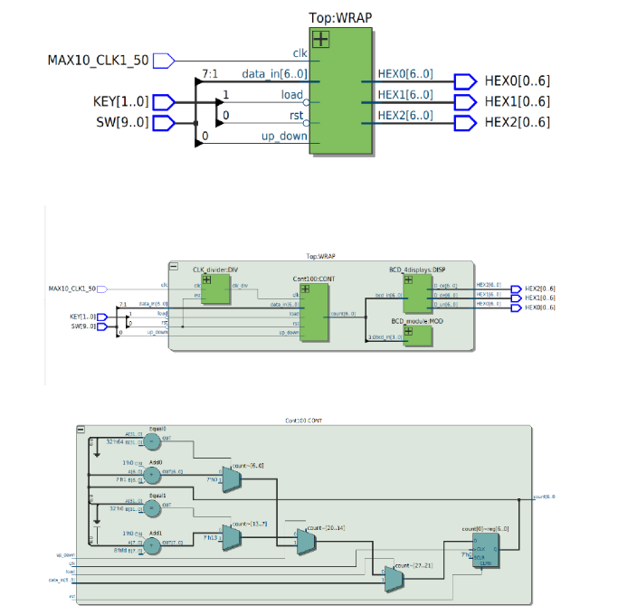
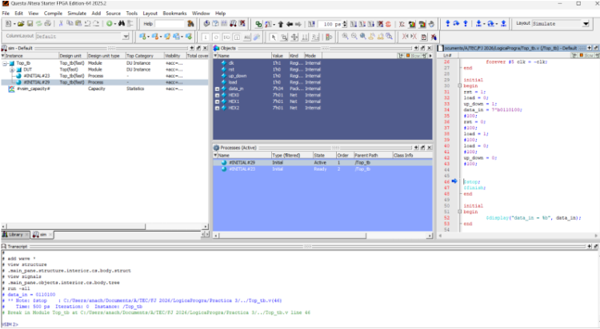
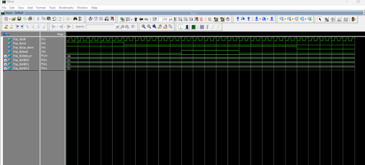
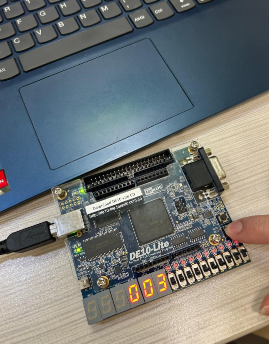
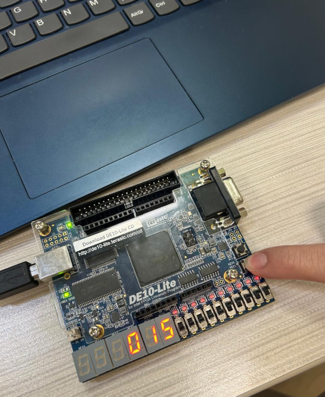

# Ana Cristina Chávez Acosta - A01742237  
## Práctica #3 — Contador 0–100 (Up/Down) con Carga Paralela (DE10-Lite)

### Objetivo
Implementar un **contador síncrono** en Verilog que cuente en el rango de **0 a 100** (configurable), con las siguientes funciones:

- **Reset** para reiniciar el conteo a 0
- Conteo **ascendente o descendente** mediante una señal `up_down`
- **Carga paralela** (load) para cargar un valor inicial `data_in`
- Mostrar/verificar el comportamiento mediante **simulación** (testbench) y evidencias de Quartus

---

## Materiales necesarios
- Tarjeta FPGA **DE10-Lite**
- Cable **USB Blaster**
- **Intel Quartus Prime Lite**
- Archivos Verilog del contador y su testbench

---

## Descripción del funcionamiento

### Entradas y salida del módulo `Cont100`
**Entradas:**
- `clk` : reloj del sistema
- `rst` : reset asíncrono (activo en alto)
- `up_down` : dirección del conteo  
  - `1` → cuenta hacia arriba  
  - `0` → cuenta hacia abajo
- `data_in[6:0]` : valor a cargar en el contador
- `load` : habilita la carga del valor `data_in`

**Salida:**
- `count[6:0]` : valor actual del contador

### Reglas de operación
- Si `rst = 1` → `count` se reinicia a **0**
- Si `load = 1` → `count` toma el valor de `data_in`
- Si `up_down = 1` (ascendente):
  - si `count == CMAX` → regresa a 0
  - en otro caso → incrementa en 1
- Si `up_down = 0` (descendente):
  - si `count == 0` → regresa a `CMAX`
  - en otro caso → decrementa en 1

> El parámetro `CMAX` está definido por defecto como 100 (`parameter CMAX = 100`).

---

## Testbench
El testbench **`Cont100_tb.v`** genera un reloj y aplica reset para observar el conteo.

- `clk` alterna cada 5 unidades de tiempo (período = 10)
- `rst` inicia en 1 por un tiempo y luego se desactiva
- Se monitorea en consola:
  - `CLK`, `rst`, y `Count` (en decimal)

---

## Evidencias (agrega tus imágenes aquí)

### Diagrama RTL

### Testbench
 

### Simulación (Waveform)
 

### FPGA en funcionamiento

---

## Archivos del proyecto
- `Practica3_BCD_Counter/Cont100.v` — Módulo contador 0–100 con `up_down` y `load`
- `Practica3_BCD_Counter/Cont100_tb.v` — Testbench (reloj + reset + monitoreo)
- `Practica3_BCD_Counter/c5_pin_model_dump.txt` — Archivo generado/auxiliar (mapeo/IO del dispositivo)
