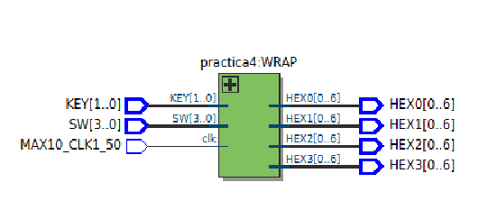
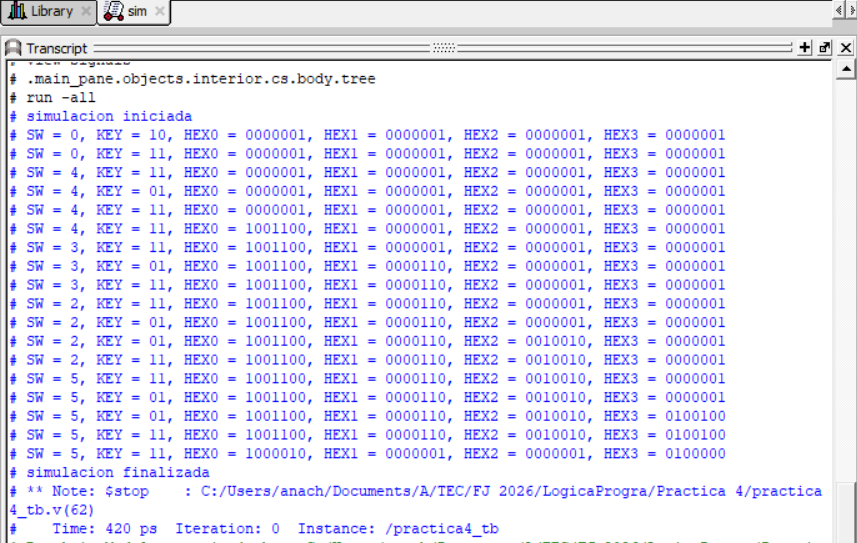
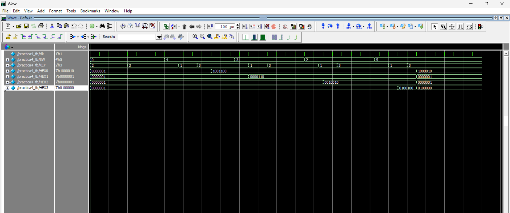

# Ana Cristina Chávez Acosta - A01742237  
## Práctica #4 — Verificación de Contraseña (FSM) con Displays 7-Segmentos (DE10-Lite)

### Objetivo
Implementar un sistema en **Verilog** que lea un dígito (0–15) desde los switches **SW[3:0]** y, al presionar un botón de validación (**CHECK**), compare secuencialmente 4 dígitos contra una contraseña predefinida.  
Al finalizar la comparación, el sistema debe indicar si la contraseña es correcta (**GOOD**) o incorrecta (**BAD**) usando los **displays HEX0–HEX3**.

---

## Materiales necesarios
- Tarjeta FPGA **DE10-Lite**
- Cable **USB Blaster**
- **Intel Quartus Prime Lite**
- Archivos Verilog del módulo y su testbench
- (Opcional) Evidencias: captura RTL y waveform de simulación

---

## Descripción del funcionamiento
- El usuario ingresa un valor en `SW[3:0]` (un dígito).
- Al presionar el botón **CHECK** (`KEY[1]`, activo en bajo), el sistema “guarda” el dígito y lo compara con el dígito esperado de la contraseña.
- El proceso se repite hasta completar 4 dígitos.
- Si los 4 dígitos coinciden con la contraseña, se muestra **GOOD**.
- Si alguno falla, se muestra **BAD** y el sistema regresa a estado inicial.

**Contraseña configurada en el código:**
- `password = 16'h5234`

> Nota: en el código se compara por nibbles (4 bits). El orden de comparación es:
> - 1er check: `password[3:0]`  → 4  
> - 2do check: `password[7:4]`  → 3  
> - 3er check: `password[11:8]` → 2  
> - 4to check: `password[15:12]`→ 5  
>
> Esto significa que el orden esperado por el FSM es: **4 → 3 → 2 → 5** (aunque el literal sea `0x5234`).

---

## Entradas y salidas

### Módulo `practica4`
**Entradas:**
- `clk` : reloj del sistema
- `SW[3:0]` : dígito a ingresar
- `KEY[1:0]` :
  - `KEY[0]` → **Reset** (activo en bajo, se invierte internamente)
  - `KEY[1]` → **Check/Next** (activo en bajo, se invierte internamente)

**Salidas:**
- `HEX0`, `HEX1`, `HEX2`, `HEX3` : displays de 7 segmentos (cada uno de 7 bits)

---

## Descripción de módulos

### 1) `practica4.v` (FSM)
Incluye:
- **Divisor de reloj** (`clk_div`) usando un contador interno
- **Máquina de estados** para comparar dígitos:
  - `IDLE` → espera el primer dígito
  - `S1`, `S2`, `S3` → compara el 2°, 3° y 4° dígito
  - `GOOD` → contraseña correcta
  - `BAD` → contraseña incorrecta
- Registro de dígitos (`display1..display4`) para convertirlos a 7 segmentos mediante `BCD_module`

---

### 2) `BCD_module.v`
Convierte un dígito BCD (0–9) a su patrón correspondiente de 7 segmentos.

- Entrada: `bcd_in[3:0]`
- Salida: `bcd_out[0:6]`

---

### 3) `BCD_4displays.v`
Se incluye como apoyo para conversiones a múltiples displays (unidades, decenas, centenas, millares).  
En esta práctica, el despliegue principal se realiza con `BCD_module` directamente para cada dígito capturado.

---

### 4) `practica4_w.v` (Wrapper)
Wrapper para mapear señales de la DE10-Lite:
- `MAX10_CLK1_50` → `clk`
- `KEY[1:0]` → entradas de control
- `SW[3:0]` → dígito
- `HEX0..HEX3` → displays

---

## Testbench
El testbench **`practica4_tb.v`** realiza la simulación:

- Genera un reloj (`clk`)
- Aplica reset con `KEY[0]`
- Simula la pulsación de `KEY[1]` (CHECK) por cada dígito
- **Fuerza `clk_div`** para no tener que esperar millones de ciclos en simulación:
  - Se usa `force DUT.clk_div = ...` para alternarlo manualmente y avanzar la FSM

---

## Evidencias (agrega tus imágenes aquí)

### Diagrama RTL

### Testbench

### Simulación (Waveform)

### FPGA en funcionamiento

---

## Archivos del proyecto
- `Practica4_Password/practica4.v` — FSM de verificación de contraseña + displays
- `Practica4_Password/practica4_w.v` — Wrapper para la DE10-Lite
- `Practica4_Password/practica4_tb.v` — Testbench (incluye force de `clk_div`)
- `Practica4_Password/BCD_module.v` — BCD a 7 segmentos (1 dígito)
- `Practica4_Password/BCD_4displays.v` — Conversión a 4 displays (auxiliar)
- `Practica4_Password/c5_pin_model_dump.txt` — Archivo auxiliar generado

---
