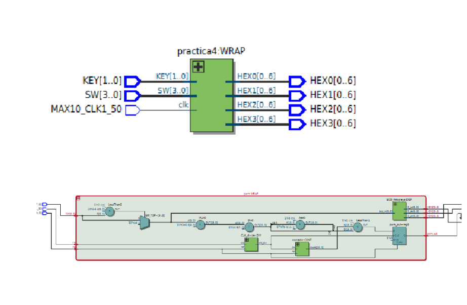
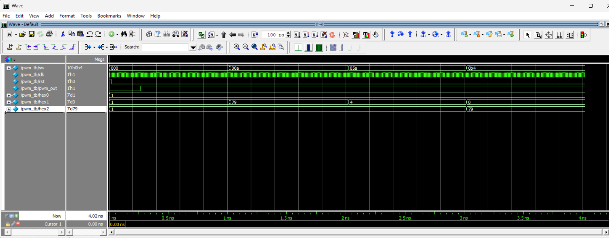
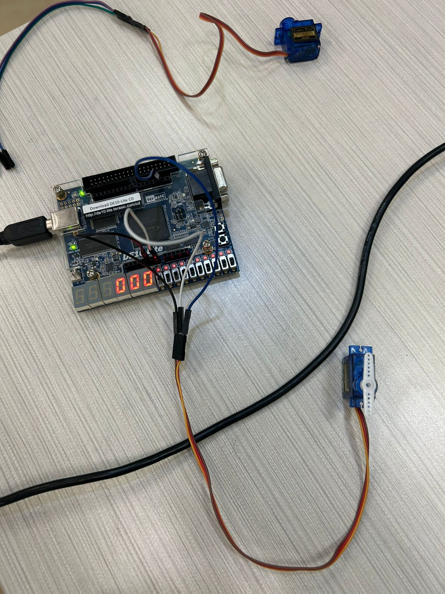
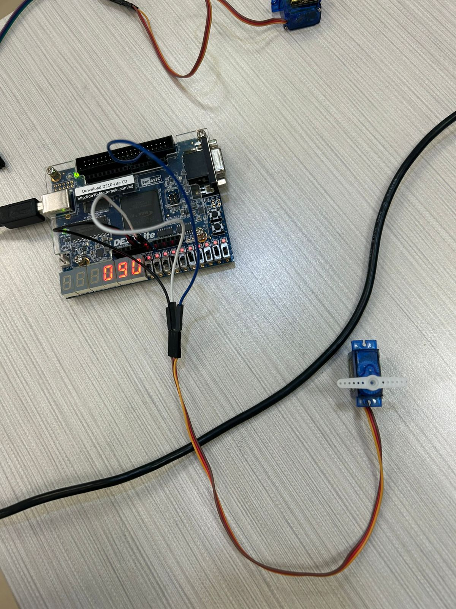

# Ana Cristina Chávez Acosta - A01742237  
## Práctica #5 — Control de Servo con PWM (DE10-Lite)

### Objetivo
Implementar un sistema en **Verilog** que genere una señal **PWM** para controlar un **servo** desde la FPGA **DE10-Lite**, variando el ciclo de trabajo (ancho de pulso) mediante switches y mostrando el valor seleccionado en **displays de 7 segmentos**.

---

## Materiales necesarios
- Tarjeta FPGA **DE10-Lite**
- Cable **USB Blaster**
- Servo (compatible con PWM estándar)
- Cables Dupont (conexión al pin/IO correspondiente)
- **Intel Quartus Prime Lite**
- Archivos Verilog del módulo y su testbench

---

## Descripción del funcionamiento
- El usuario ingresa un valor con `SW` (entrada de 10 bits en simulación / 8 bits en el wrapper).
- El sistema limita el valor máximo a **180** (grados).
- Se genera un reloj dividido para obtener una base adecuada para PWM.
- Un contador recorre un período fijo y se compara contra un umbral (`comparador`).
- La salida `pwm_out` se pone en **1** mientras `count <= comparador`, y en **0** el resto del período.
- El valor (0–180) se muestra en 7 segmentos con un módulo BCD.

---

## Entradas y salidas

### Módulo `pwm`
**Entradas:**
- `SW[9:0]` : valor de referencia (limitado a 180)
- `clk` : reloj del sistema
- `rst` : reset (activo en alto)

**Salidas:**
- `pwm_out` : señal PWM para el servo
- `HEX0`, `HEX1`, `HEX2` : displays (unidades, decenas, centenas)

---

## Descripción de módulos

### 1) `pwm.v`
- Limita `SW` a 180 (`SW_TOP`).
- Usa un divisor de reloj (`CLK_divider`) para generar `clk_div`.
- Usa un contador (`contador`) para crear un período de PWM.
- Calcula un umbral (`comparador`) proporcional a `SW_TOP`.
- Genera `pwm_out` comparando `count` vs `comparador`.
- Muestra `SW_TOP` en HEX mediante `BCD_4displays`.

---

### 2) `contador.v`
Contador síncrono con reset:

- Cuenta desde 0 hasta `CMAX`
- Reinicia a 0 cuando llega al máximo

Se utiliza como base para el período de PWM.

---

### 3) `BCD_module.v`
Decodificador para **un solo display** de 7 segmentos.

- Entrada: `bcd_in[3:0]` (0 a 9)
- Salida: `bcd_out[0:6]` (segmentos)

---

### 4) `BCD_4displays.v`
Convierte un número en:
- unidades, decenas, centenas, millares
y los manda a 4 instancias de `BCD_module`.

En este proyecto se usan solo:
- `HEX0` (unidades)
- `HEX1` (decenas)
- `HEX2` (centenas)

---

### 5) `pwm_w.v` (Wrapper)
Wrapper para mapear señales de la DE10-Lite:
- `MAX10_CLK1_50` → `clk`
- `KEY[0]` → reset (invertido)
- `SW[7:0]` → valor de control
- `ARDUINO_IO[2]` → salida PWM hacia el servo

---

## Testbench
El archivo **`pwm_tb.v`** realiza pruebas básicas:

- Genera un reloj con período de 10 unidades (`always #5 clk = ~clk`)
- Aplica reset al inicio
- Cambia `SW` a diferentes valores (ej. 10, 90, 180) para observar:
  - cambios en `pwm_out`
  - cambios en displays HEX

---

## Evidencias (agrega tus imágenes aquí)

### Diagrama RTL

### Simulación (Waveform - Testbench)

### Servo en funcionamiento (DE10-Lite)

---

## Archivos del proyecto
- `Practica5_Pwm/pwm.v` — Generación de PWM + BCD a displays
- `Practica5_Pwm/contador.v` — Contador para periodo PWM
- `Practica5_Pwm/pwm_w.v` — Wrapper para DE10-Lite (mapeo SW/CLK/KEY/Arduino IO)
- `Practica5_Pwm/pwm_tb.v` — Testbench
- `Practica5_Pwm/BCD_module.v` — BCD a 7 segmentos (1 dígito)
- `Practica5_Pwm/BCD_4displays.v` — Separación a 4 displays
- `Practica5_Pwm/c5_pin_model_dump.txt` — Archivo auxiliar generado
