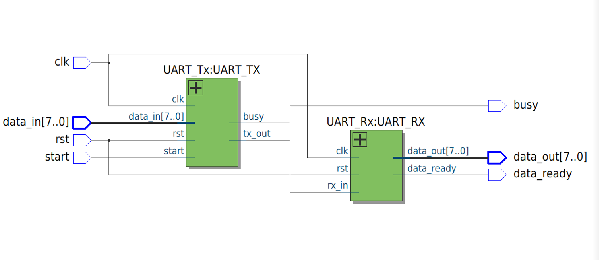
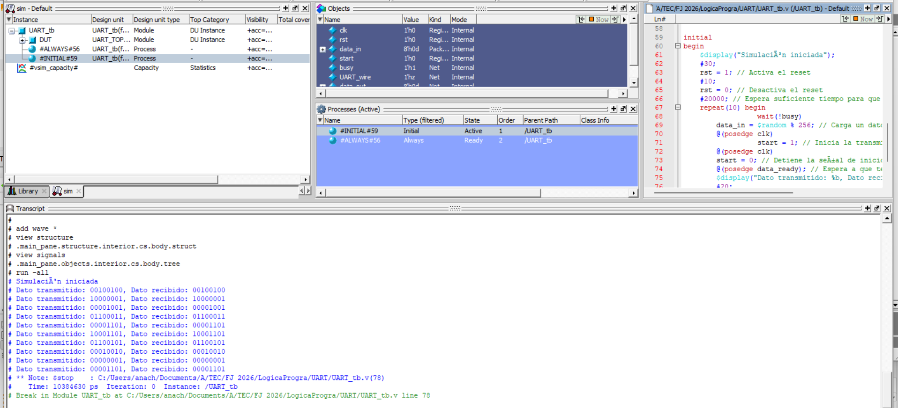
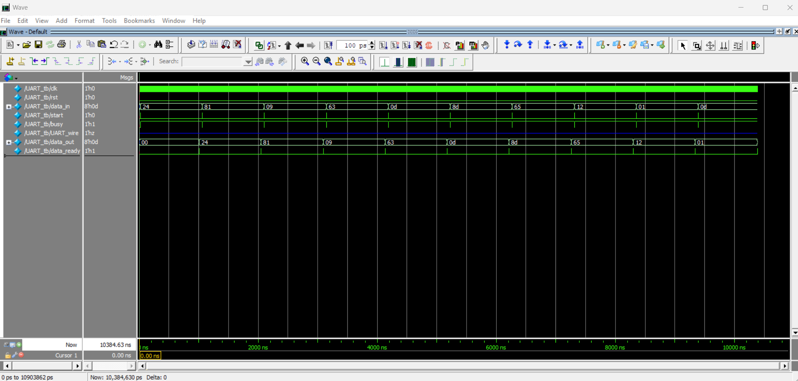

# Ana Cristina Chávez Acosta - A01742237  
## Práctica #6 — Comunicación UART entre Cyclone V y DE10-Lite (TX/RX)

### Objetivo
Implementar el protocolo **UART (Universal Asynchronous Receiver/Transmitter)** en **Verilog** para transmitir números desde una tarjeta FPGA a otra, utilizando:

- Una tarjeta como **Transmisor (TX)** (Cyclone V)
- Una tarjeta como **Receptor (RX)** (DE10-Lite)

El sistema envía datos en formato serial y el receptor los reconstruye en paralelo, mostrando el valor recibido en **displays de 7 segmentos** y señalando cuando el dato está listo.

---

## Materiales necesarios
- Tarjeta FPGA **Cyclone V**
- Tarjeta FPGA **DE10-Lite**
- Cables Dupont (conexión TX ↔ RX y GND común)
- Cable **USB Blaster**
- **Intel Quartus Prime Lite**
- Archivos Verilog del transmisor, receptor, wrappers y testbenches

---

## Descripción del funcionamiento
UART transmite datos en serie usando:
- **1 bit de inicio** (start bit = 0)
- **8 bits de datos** (LSB primero)
- **1 bit de parada** (stop bit = 1)

En este proyecto:
- El módulo **UART_Tx** toma un dato en paralelo (`data_in`) y lo transmite por `tx_out`
- El módulo **UART_Rx** recibe la señal por `rx_in`, detecta el start bit, muestrea los bits a la velocidad de baudios y entrega el byte recibido en `data_out`
- La señal `data_ready` indica que el byte ya fue recibido correctamente

**Parámetros principales:**
- `BAUD_RATE = 9600`
- `CLOCK_FREQ = 50_000_000` (50 MHz)
- `BITS = 8`

---

## Conexiones de hardware (recomendación)
Para comunicar dos tarjetas:
- **TX (GPIO[0] / pin de salida)** de la tarjeta transmisora → **RX (ARDUINO_IO[0] / pin de entrada)** de la tarjeta receptora
- Conectar **GND con GND** (muy importante)
- Asegurar el mismo nivel lógico (3.3V típicamente en ambas)

---

## Entradas y salidas

### `UART_Tx.v` (Transmisor)
**Entradas:**
- `clk` : reloj
- `rst` : reset
- `data_in[7:0]` : byte a transmitir
- `start` : inicia transmisión

**Salidas:**
- `tx_out` : línea UART TX (serial)
- `busy` : indica transmisión en progreso

---

### `UART_Rx.v` (Receptor)
**Entradas:**
- `clk` : reloj
- `rst` : reset
- `rx_in` : línea UART RX (serial)

**Salidas:**
- `data_out[7:0]` : byte recibido
- `data_ready` : pulso indicando dato recibido
- Señales de debug (por estado):
  - `idle`, `startbit`, `databits`, `stopbits`

---

## Descripción de módulos

### 1) `UART_Tx.v`
Máquina de estados:
- `IDLE` → espera `start`
- `START_BIT` → envía 0
- `DATA_BITS` → envía 8 bits LSB first
- `STOP_BIT` → envía 1 y regresa a IDLE

Controla tiempos usando un contador de baudios:
- `CLOCK_FREQ / BAUD_RATE`

---

### 2) `UART_Rx.v`
Máquina de estados:
- `IDLE` → espera transición a 0 (start bit)
- `START_BIT` → valida start bit muestreando a medio periodo
- `DATA_BITS` → muestrea 8 bits cada periodo de baudios
- `STOP_BIT` → valida stop bit y levanta `data_ready`

Incluye sincronización `rx_sync1/rx_sync2` para evitar metastabilidad.

---

### 3) `UART_TOP.v`
Módulo integrador para simulación:
- Conecta `UART_Tx` y `UART_Rx` internamente mediante `UART_wire`

---

### 4) Wrappers para FPGA

#### `UART_WRAP_Tx.v` (Transmisor en tarjeta)
- Usa switches para definir el dato a transmitir
- Usa botón para disparar `start`
- Muestra el valor a transmitir en displays HEX con `BCD_4displays`

#### `UART_WRAP_Rx.v` (Receptor en tarjeta)
- Recibe por `ARDUINO_IO[0]`
- Señaliza `data_ready` en `LEDR[0]`
- Muestra el byte recibido en HEX usando `BCD_4displays`

---

## Testbenches

### `UART_Tx_Tb.v`
Prueba el transmisor:
- Genera reloj
- Aplica reset
- Envía valores aleatorios con `start`
- Espera a que `busy` se libere antes de repetir

---

### `UART_tb.v`
Prueba el sistema completo con `UART_TOP`:
- Envía múltiples bytes aleatorios
- Espera `data_ready` y compara:
  - Dato transmitido vs dato recibido

---

## Evidencias

### Diagrama RTL

### Testbench

### Simulación (Waveform)

### Conexión entre tarjetas / funcionamiento físico
**Cyclone V ↔ DE10-Lite funcionando:** https://youtube.com/shorts/LH_i8p3NJQc

---

## Archivos del proyecto
- `Practica6_UART/UART_Tx.v` — Transmisor UART
- `Practica6_UART/UART_Rx.v` — Receptor UART
- `Practica6_UART/UART_TOP.v` — Top para simulación (TX conectado a RX)
- `Practica6_UART/UART_Tx_Tb.v` — Testbench del transmisor
- `Practica6_UART/UART_tb.v` — Testbench del sistema completo
- `Practica6_UART/UART_WRAP_Tx.v` — Wrapper TX (Cyclone V)
- `Practica6_UART/UART_WRAP_Rx.v` — Wrapper RX (DE10-Lite)
- `Practica6_UART/UART_WRAP.v` — Wrapper alterno (si aplica)
- `Practica6_UART/c5_pin_model_dump.txt` — Archivo auxiliar generado

---
