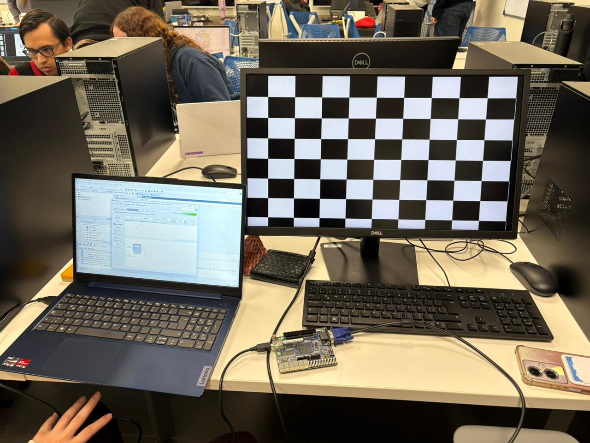

# Ana Cristina Chávez Acosta - A01742237  
## Práctica #7 — Salida VGA (Tablero de Ajedrez con XOR) en DE10-Lite

### Objetivo
Implementar una señal de video **VGA 640×480 @ 60 Hz** en **Verilog** para mostrar un patrón tipo **tablero de ajedrez** en un monitor, utilizando la FPGA **DE10-Lite**.  
El patrón se genera comparando bits de las coordenadas `CounterX` y `CounterY` mediante una operación **XOR**.

---

## Materiales necesarios
- Tarjeta FPGA **DE10-Lite**
- Cable **USB Blaster**
- Monitor con entrada **VGA**
- Cable VGA
- **Intel Quartus Prime Lite**
- Evidencias en imagen del funcionamiento (monitor)

---

## Descripción del funcionamiento
El proyecto se compone de dos módulos principales:

1. **`VGA.v`**
   - Genera los contadores de posición horizontal y vertical:
     - `CounterX` recorre 0–799 (incluye zona visible + porches + sync)
     - `CounterY` recorre 0–524
   - Genera las señales de sincronización:
     - `vga_h_sync` (HSYNC)
     - `vga_v_sync` (VSYNC)
   - Genera la señal `inDisplayArea` para indicar si el pixel está dentro de la zona visible (**640×480**)

2. **`VGADemo.v`**
   - Genera un **pixel_tick** (enable) a ~25 MHz, dividiendo el reloj de 50 MHz:
     - `pixel_tick <= ~pixel_tick;`
   - En la zona visible, crea el tablero de ajedrez con:
     - `CounterX[6] ^ CounterY[6]`
   - Si el XOR es 1 → pixel blanco (`3'b111`)
   - Si el XOR es 0 → pixel negro (`3'b000`)

---

## Entradas y salidas

### Módulo `VGADemo`
**Entrada:**
- `MAX10_CLK1_50` : reloj de 50 MHz de la DE10-Lite

**Salidas:**
- `pixel[2:0]` : color del pixel (3 bits RGB simplificado)
- `hsync_out` : sincronización horizontal VGA
- `vsync_out` : sincronización vertical VGA

---

## Generación del tablero de ajedrez (XOR)
Dentro del área visible:
- Se toma un bit de `CounterX` y un bit de `CounterY`
- Se aplica XOR para alternar cuadros

```verilog
if(CounterX[6] ^ CounterY[6])
    pixel <= 3'b111;
else 
    pixel <= 3'b000;
```

Cambiar el bit usado (por ejemplo `[5]`, `[7]`) modifica el tamaño de los cuadros:
- Bit más bajo → cuadros más pequeños
- Bit más alto → cuadros más grandes

---

## Pruebas realizadas
Esta práctica **no incluye testbench**, ya que se probó directamente conectando la DE10-Lite a un **monitor VGA** y verificando visualmente el patrón mostrado.

---

## Evidencias 

### Monitor funcionando (Tablero de ajedrez)



---

## Archivos del proyecto
- `Practica7_VGA/VGA.v` — Generador de sincronización y contadores VGA
- `Practica7_VGA/VGADemo.v` — Generación del patrón (tablero de ajedrez con XOR)
